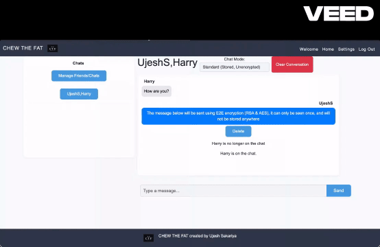
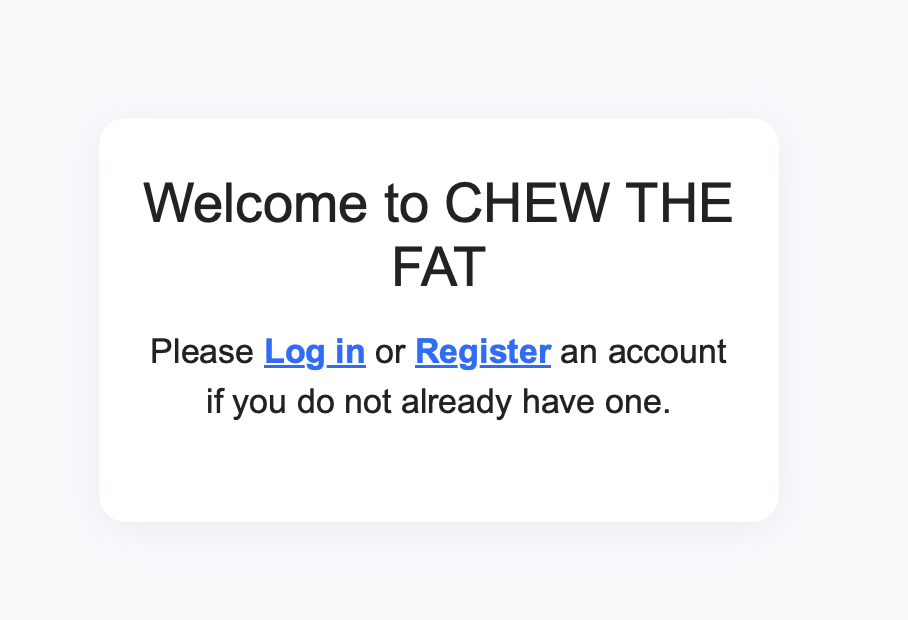
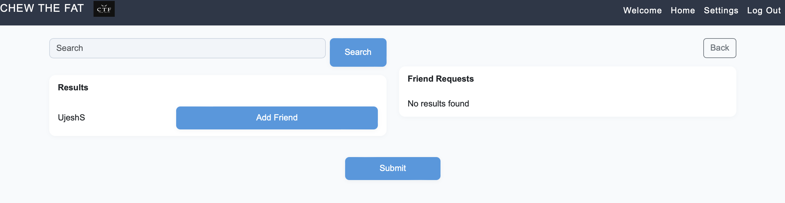
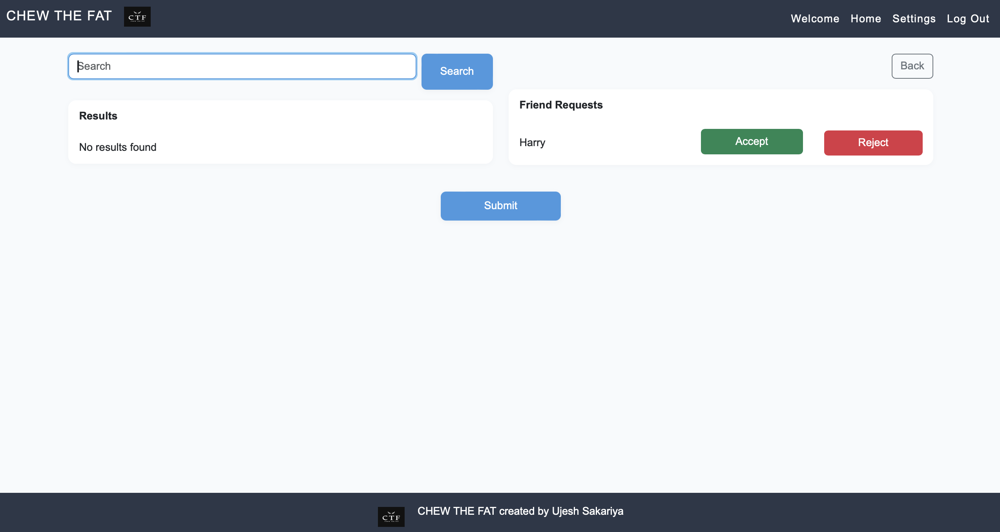
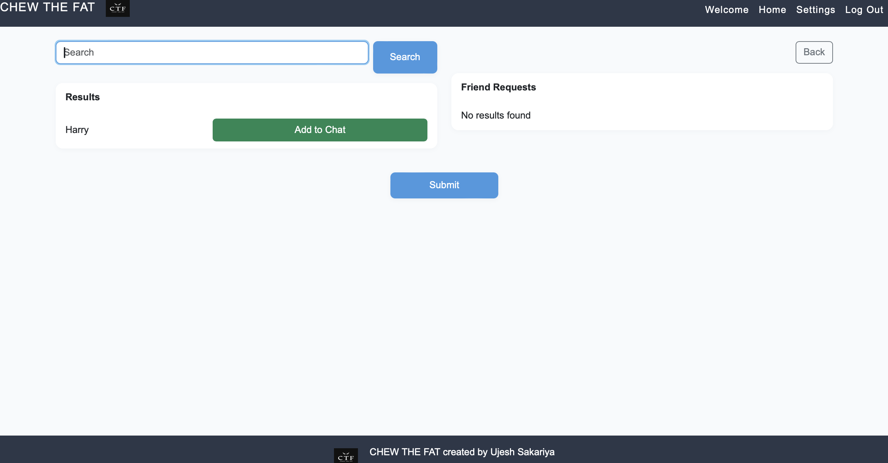
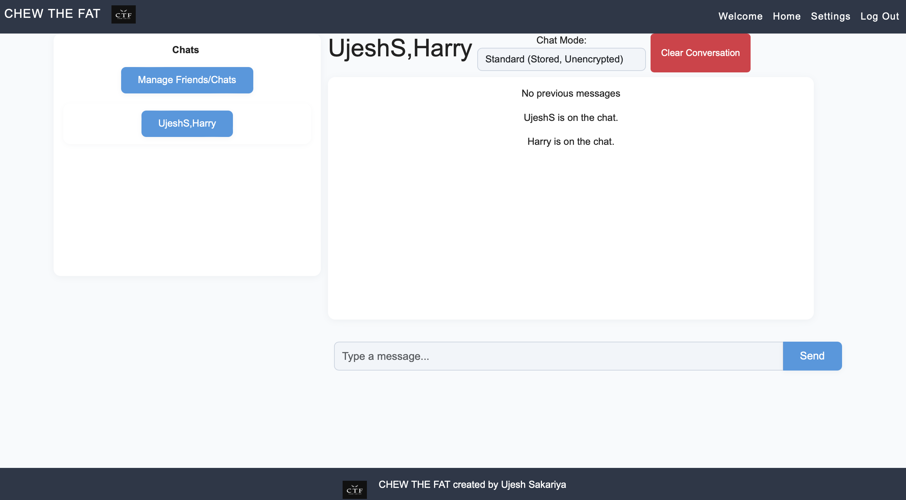

# ChewTheFat

# Secure E2E Messaging Application

Chew The Fat is a secure, real-time messaging app that combines RSA and AES encryption with 2FA and socket-based messaging to provide a privacy-first user chat experience.

## 🚀 Features

- **User Authentication**
  - Account creation and login
  - Google 2FA (Two-Factor Authentication)
  - Reset password support

- **Messaging**
  - One-to-one and group chats
  - Real-time messaging with WebSockets
  - Notifications for when a user is on the chat
  - Message deletion (individual or entire conversation)
  - Send permanent and dissapearing messages

## 2 Modes

- **End-to-End Encrypted Mode (E2E)**
  - Messages are encrypted client-side
  - Encrypted Messages are sent securely
  - Decrypted on client side for one time viewing and **never stored** on the database

- **Standard Messaging Mode**
  - Messages are stored in the database in plain text
  - Suitable for persistent, accessible conversation history

- **Friends and Discovery**
  - Add/remove friends
  - Search and discover new users
  - Maintain a friend list
  - Make new chats / groupchats

## 🔐 Security Details
 
  - **E2E Encryption Flow**:
  - RSA key pair fully implemented and coded from scratch, generated per user upon registration
  - AES encryption algorithm also fully coded manually, used to encrypt the RSA private key in 16-byte blocks
  - AES key derived from the user's password using SHA-256
  - The encrypted private key is securely stored in the database
  - Upon selecting E2E mode, the encrypted key is sent to the frontend and decrypted locally
  - This approach guarantees that message content remains private and inaccessible to the server

- **2FA Integration**:
  - Time-based one-time passwords (TOTP) using Google Authenticator
  - Prevents unauthorised access even if passwords are compromised

## 🛠️ Tech Stack

- **Frontend:** HTML, CSS, JavaScript  
- **Backend:** Python with Flask framework and Jinja templating  
- **Real-time Communication:** Flask-SocketIO for WebSocket handling  
- **Database:** MySQL (using MySQL Connector for Python)  
- **Data Persistence:** Pickle (`.pkl`) files to manage and maintain the friends system  
- **Encryption:** Custom-implemented RSA and AES algorithms for end-to-end encryption  

## Demo Photos And Videos
**In the video you can see:**
- Being able to choose between encrypted/ephemeral messages and unencryped/stored messages
- messages being sent in real time using websockets
- delete messages
- delete entire conversations

**Complete autonomy of how your private conversations are stored and sent**

**On the homepage, you can login or register an account**

**You will then be asked to sign up for 2FA if you are creating a new account or just enter your TOTO if you are logging in**

**You can send Friend Requests**

**Manage your friend requests**

**Add your friends to chats**

**See when your friends are on the chat**

