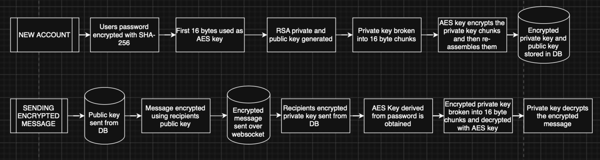
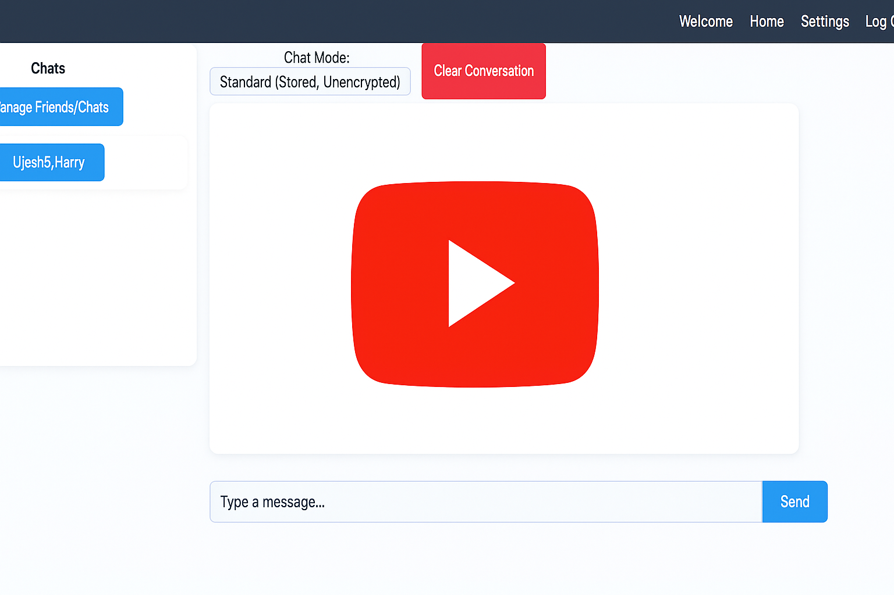
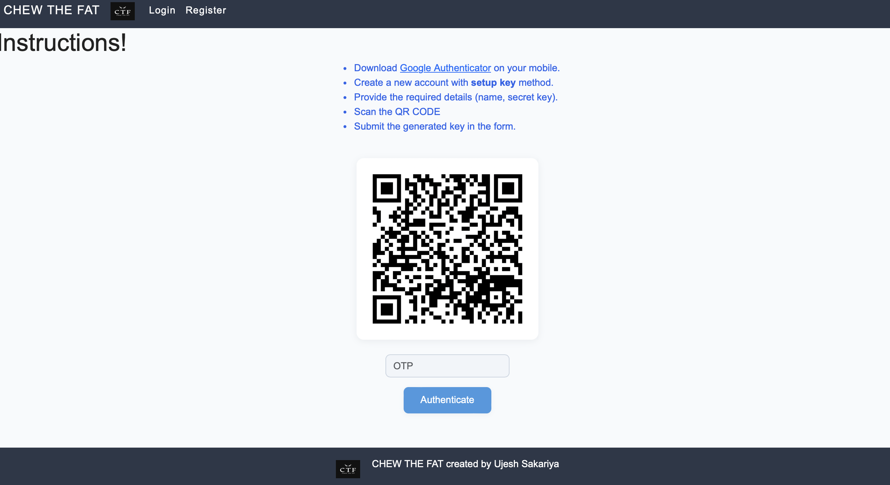

# ChewTheFat

# 🔐 Secure E2E Messaging Application

Chew The Fat is a secure, real-time messaging app that combines RSA and AES encryption with 2FA and socket-based messaging to provide a privacy-first user chat experience.

## 🚀 Features

- **User Authentication**
  - Account creation and login
  - Google 2FA (Two-Factor Authentication)
  - Reset password support

- **Messaging**
  - One-to-one and group chats
  - Real-time messaging with WebSockets
  - Notifications for when a user is on the chat
  - Message deletion (individual or entire conversation)
  - Send permanent and dissapearing messages

### 2 Modes

- **End-to-End Encrypted Mode (E2E)**
  - Messages are encrypted client-side
  - Encrypted Messages are sent securely
  - Decrypted on client side for one time viewing and **never stored** on the database

- **Standard Messaging Mode**
  - Messages are stored in the database in plain text
  - Suitable for persistent, accessible conversation history

- **Friends and Discovery**
  - Add/remove friends
  - Search and discover new users
  - Maintain a friend list
  - Make new chats / groupchats

## ⚠️ Disclaimer

*Note: This project demonstrates cryptographic concepts in a learning environment; it is not intended as a production-secure messaging platform.*

## 🔐 End-to-End Encryption (E2E) Flow

- **RSA Key Generation**: Fully implemented from scratch; a unique key pair is generated per user upon registration.
- **AES Encryption**: Also manually implemented; used to encrypt the RSA private key in 16-byte blocks.
- **Password-Derived AES Key**: AES key derived from the user's password using SHA-256.
- **Secure Storage**: Encrypted private key is securely stored in the database.
- **Client-Side Decryption**: When E2E mode is enabled, the encrypted key is sent to the frontend and decrypted locally.
- **Privacy Guarantee**: This approach ensures message content remains private and inaccessible to the server.
- **Code Reference**: Implementation code can be found in `static/js`.

**Here is a flow diagram demonstrating it:**

- **2FA Integration**:
  - Time-based one-time passwords (TOTP) using Google Authenticator
  - Prevents unauthorised access even if passwords are compromised

## 🛠️ Tech Stack

- **Frontend:** HTML, CSS, JavaScript  
- **Backend:** Python with Flask framework and Jinja templating  
- **Real-time Communication:** Flask-SocketIO for WebSocket handling  
- **Database:** MySQL (using MySQL Connector for Python)  
- **Data Persistence:** Pickle (`.pkl`) files to manage and maintain the friends system  
- **Encryption:** Custom-implemented RSA and AES algorithms for end-to-end encryption  

## Demo Photos And Videos

**In the video you can see:**
- Being able to choose between encrypted/ephemeral messages and unencryped/stored messages
- messages being sent in real time using websockets
- delete messages
- delete entire conversations

**Complete autonomy of how your private conversations are stored and sent**

### Screenshots:

**2FA setup/login**

**Sending/Recieving friend requests**

**Manage friend requests**

**Add friends to chats**

**Messaging Screen with real-time presence**

